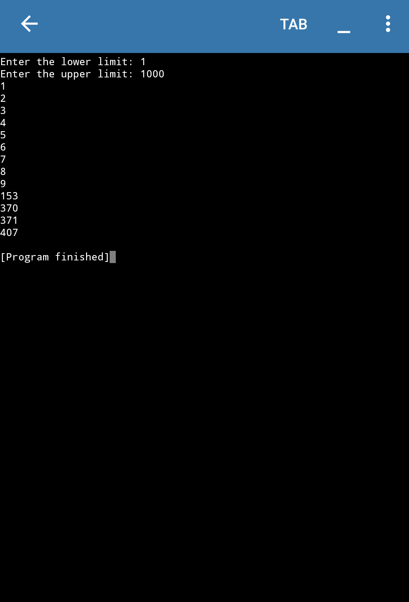

# 🔢 Armstrong Number Checker (Python)

This repository contains multiple implementations of Armstrong number checking algorithms using Python.

An **Armstrong number** (also known as a narcissistic number) is a number that is equal to the sum of its own digits raised to the power of the number of digits.

Example:  
153 → 1³ + 5³ + 3³ = 153 ✅

---

## 📂 Files Included:

- `armstrong_function_basic.py` – Basic function using string conversion.
- `armstrong_while_loop.py` – Using a while loop and modulus.
- `armstrong_range_check.py` – Finding all Armstrong numbers in a given range.
| `armstrong_range_user_input.py` | Finding all Armstrong numbers in a range input by user.
- `armstrong_with_steps.py` – Armstrong check with visual step explanation.

## 🧠 What You Learn:

- How to extract digits from a number
- How to calculate power
- While loop logic
- Function usage
- Checking numbers in a range

---

### 📸 Output Screenshot

Here's a sample output of the **optimized Armstrong number program**:

---

## 👩‍💻 Author

Made with 💙 by **Adiba Rahman**  
📧 adibarahmanwarsiii@gmail.com  
🌐 [My Portfolio](https://adibaarahman.github.io)  
🐱‍💻 [GitHub](https://github.com/AdibaaRahman)

---

## 📜 License 

This project is open-source and free to use.
